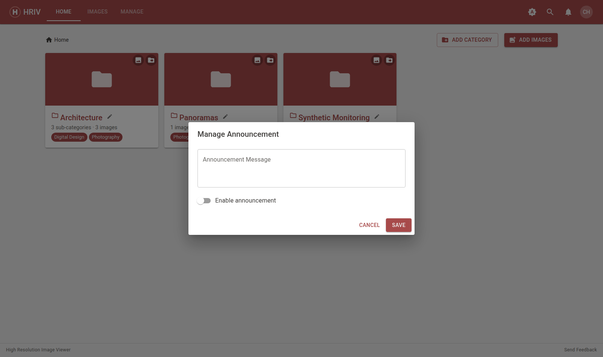
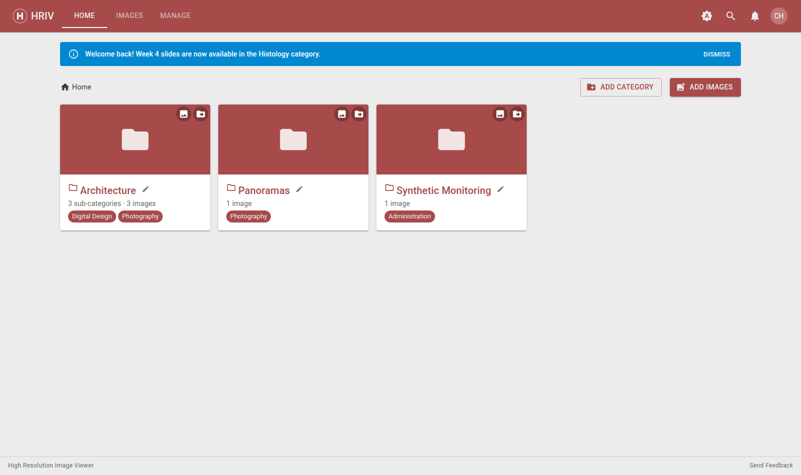

# Announcements

Post one shared announcement that every user sees — students and instructors
alike — as a banner at the top of the app and on the sign-in screen.

Open **Manage → Announcement**.

1. Type your message.
2. Switch on **Enable announcement**.
3. **Save**.

- Users can dismiss the banner; it comes back whenever you change the
  message.
- To remove it, open the editor and switch **Enable announcement** off.
- You can also view the current announcement any time from your profile
  menu (your avatar → the announcement link).

::: tip Keep it short
The banner is a single line — a sentence or two works best.
:::
