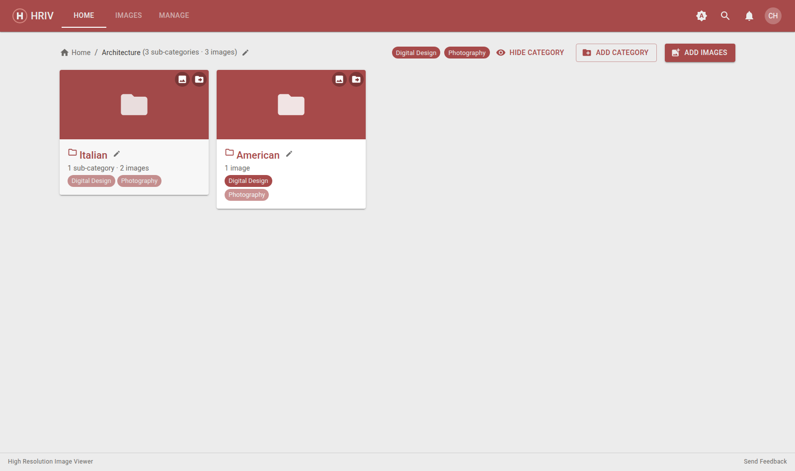
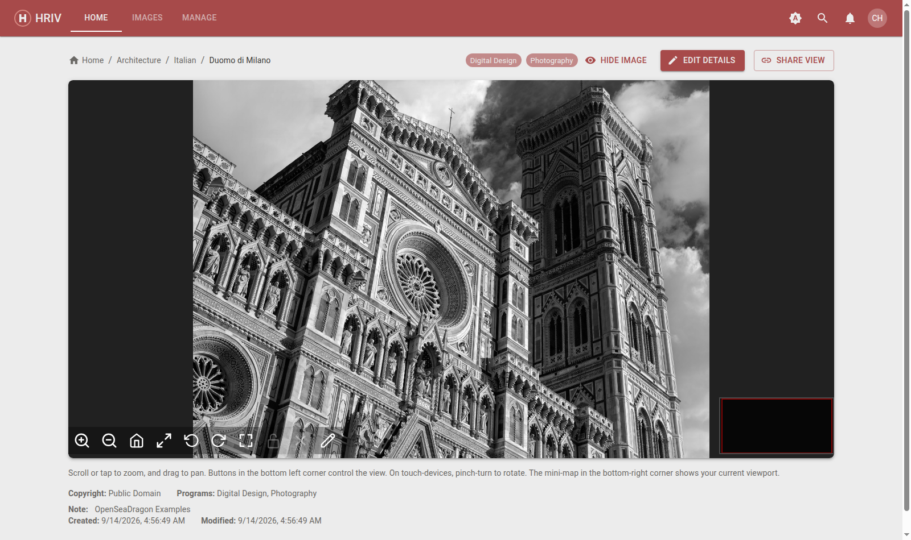

# Browsing & Viewing

The **Home** tab is the image library — the same view your students get
(they see less: hidden and restricted content is removed for them).

## Finding images

- **Category tiles** group images into folders. Click one to look inside —
  categories can contain more categories.
- **Image tiles** show a thumbnail. Click to open the viewer.
- Use the **breadcrumbs** at the top to jump back up, or **Home** to return
  to the top level.
- The **search icon** in the top bar searches across images by name, note,
  and other details.

## Viewing an image

Click an image tile to open the full-screen viewer. The image is a "deep
zoom" — you can zoom in to see fine detail without losing quality.

### Viewer toolbar (bottom left)

| Button             | What it does                                                              |
| ------------------ | ------------------------------------------------------------------------- |
| **+** / **–**      | Zoom in / out (mouse wheel works too)                                     |
| **House**          | Reset the view to the whole image                                         |
| **Arrows**         | Toggle fullscreen (press `Esc` to exit)                                   |
| **Curved arrows**  | Rotate the image left / right                                             |
| **Selection tool** | Draw measurement boxes — see [Measuring](images#measuring-on-an-image)    |
| **Padlock**        | Lock or unlock the boxes you've drawn                                     |
| **X**              | Clear all boxes                                                           |
| **Pencil**         | Open the annotation canvas — see [Annotating](images#annotating-an-image) |

Drag to pan. The **mini-map** in the bottom right shows where you are, and
the number on it is the current magnification when the image has a scale
configured.

::: tip Sharing what you see
Your zoom position stays in the address bar — copy the URL to send a link
that opens to exactly the spot you're looking at.
:::
