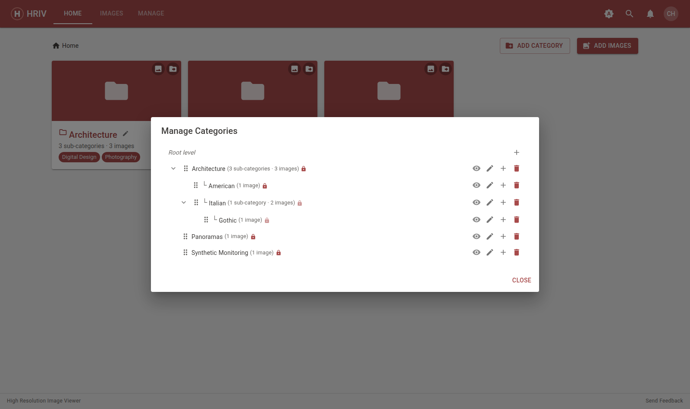
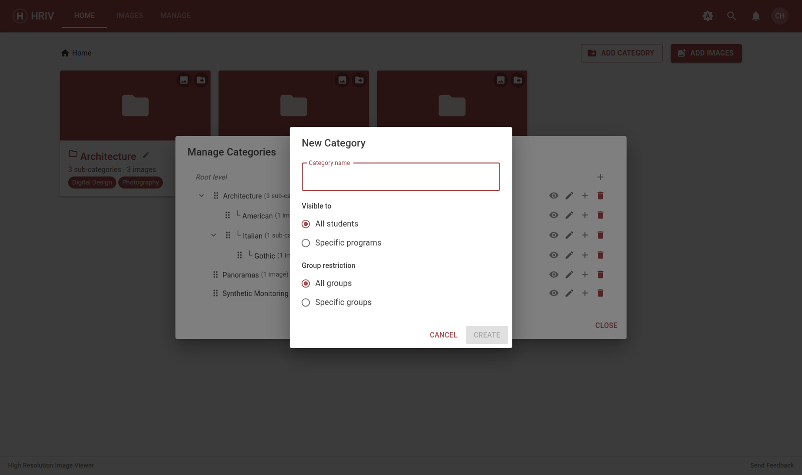
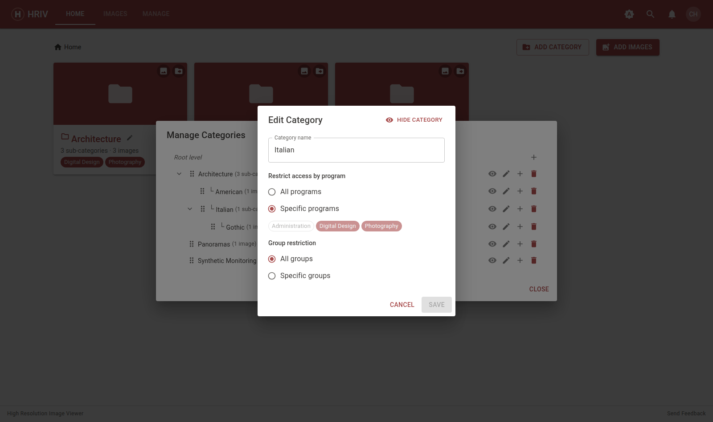
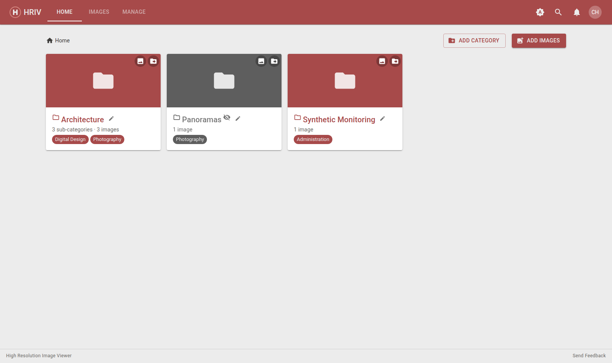
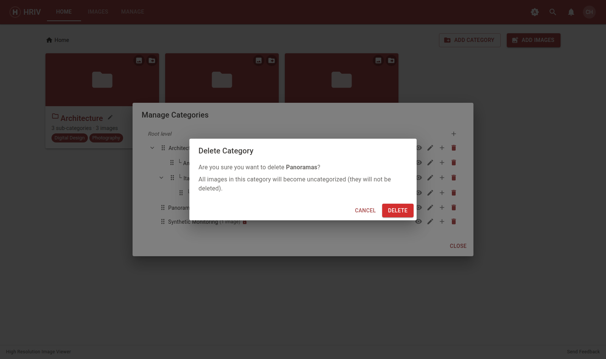

# Managing Categories

Categories are folders for your images. They can hold images **and** other
categories, so you can build a tree like `Histology → Week 3 → Lab slides`.

Open **Manage → Categories** to see the full tree.

## Add a category

1. Click the **+** next to _Root level_ (top level) or next to any category
   (makes a sub-category).
2. Type a name and press **Create**.

::: warning Names must be unique among siblings
Two categories inside the same parent can't share a name — pick a slightly
different one.
:::

## Reorder categories

Drag a category up or down in the **Manage Categories** list to change the
order students see it. You can also drag tiles on the **Home** page.

## Move a category (make it a sub-category)

- Click the **move arrow** on a category tile on the **Home** page, then
  pick the new parent (including _top level_).
- Or drag a category onto another category — in the Manage list or on the
  Home grid — to nest it inside.

## Rename, restrict, or hide a category

Click the **pencil** next to a category to rename it or change who can see
it:

- **Visible to** — `All programs` (default) or `Specific programs`. Picking
  programs limits the category to students in those programs.
- **Groups** — `All groups` or `Specific groups` (see
  [Managing Groups](groups)).
- Click the **eye** in the list to hide a category without restricting it:
  hidden categories (and everything inside them) disappear for students but
  stay visible to you in grey.

## Delete a category

Click the **trash** icon and confirm.

- Images inside are **not** deleted — they move to _Uncategorized_.
- Sub-categories **are** deleted with it. The confirmation tells you how
  many.

