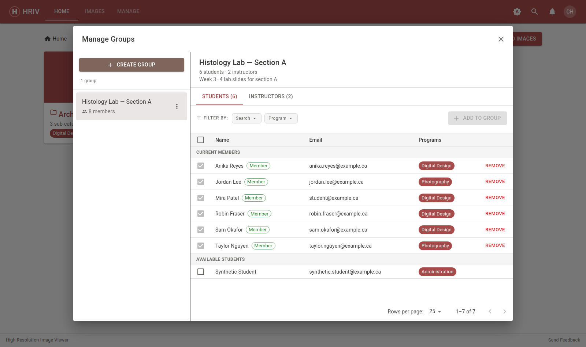

# Managing Groups

Groups let you restrict a category to a hand-picked set of students — for
example, one section's lab slides, or a class's assignment images.

Open **Manage → Groups**.

## Create a group

1. Click **Create Group** at the top of the group list.
2. Name the group (the description is optional) and save.

To rename or delete a group later, use the ⋮ menu on its name.

::: warning Deleting
A group that's still attached to a category can't be deleted — detach it
from those categories first.
:::

## Add students

1. Select your group on the left.
2. On the **Students** tab, find students:
   - **Search** by name or email.
   - Click **program chips** to narrow the list to a program.
   - Sort columns by clicking their headings.
3. Tick the checkbox for each student — the header checkbox selects everyone
   on the page — then click **Add to group**.

Members appear with a **Member** chip; use the trash icon to remove one.

## Add instructors

The **Instructors** tab works the same way and adds **co-owners** — other
instructors who can manage this group too.

::: tip
A group must always keep at least one instructor — you can't remove the
last one.
:::

## Restrict a category to a group

Groups don't do anything until you attach them to a category:

1. Open **Manage → Categories**.
2. Click the **pencil** on the category.
3. Under **Groups**, choose **Specific groups** and tick your group.

Now only students in that group (and in any required programs) can see the
category and its images.

::: warning Restrictions combine
If a category has both program and group restrictions, students need to be
in **both** to see it. Restrictions on a parent category apply to everything
inside it.
:::
