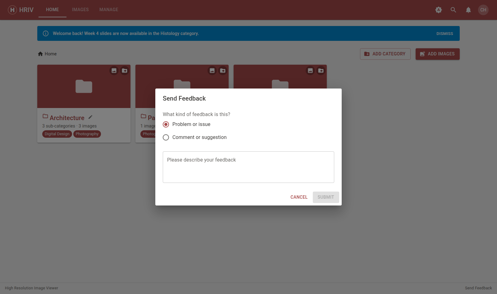
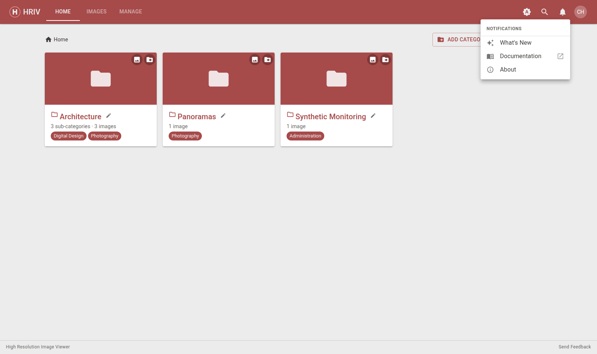

# Getting Help

## Send feedback

Click **Send Feedback** at the bottom of any page — found in the footer
next to the version numbers.

- Pick **Problem or issue** or **Comment or suggestion**.
- Describe what's wrong (or what you'd like to see) and press **Submit**.
- The feedback goes straight to the HRIV team, along with which page you
  were on.

## Other spots to check

- The **bell icon** (top right) → **What's New** lists recent changes to
  the app.
- **About** in the same menu shows the running version — handy to mention
  when reporting a problem.
- Need to reach a person? Contact the BCIT Teaching and Learning Unit —
  there's a link in the footer.

