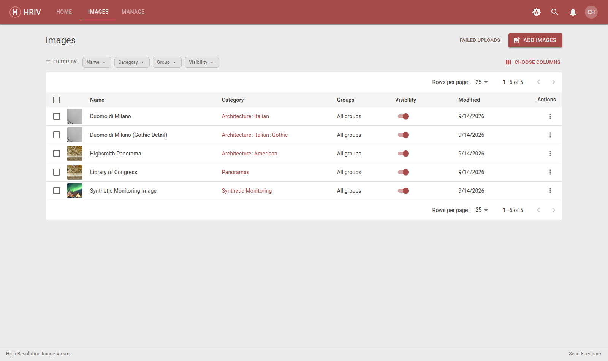
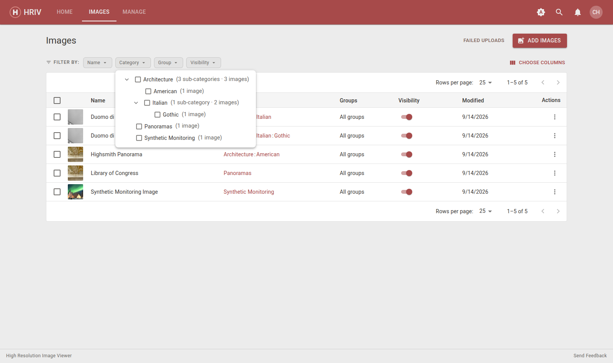
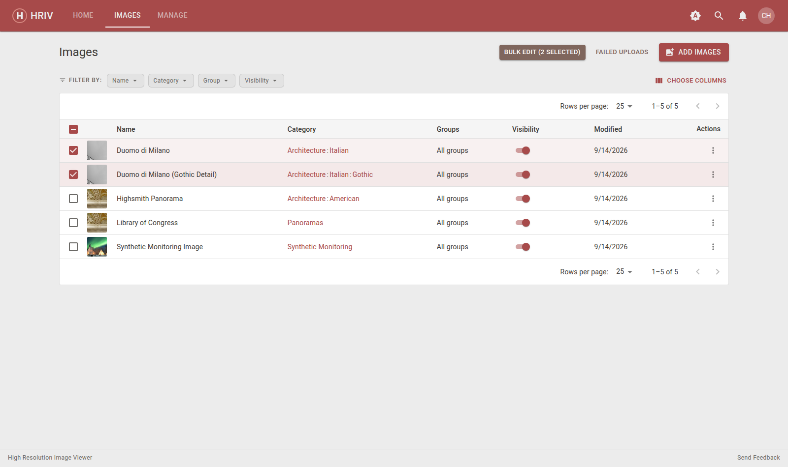
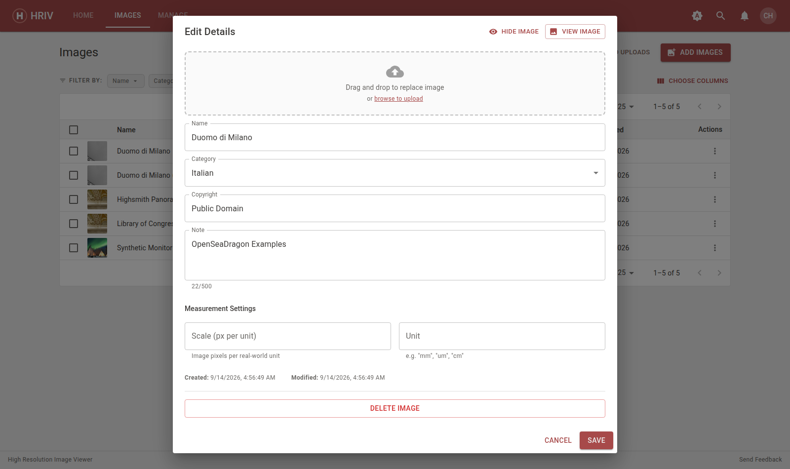
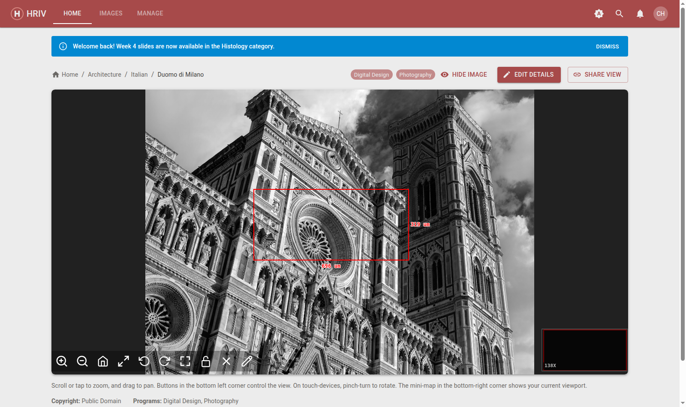
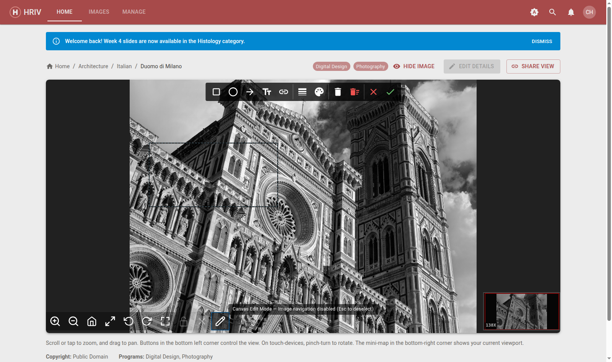
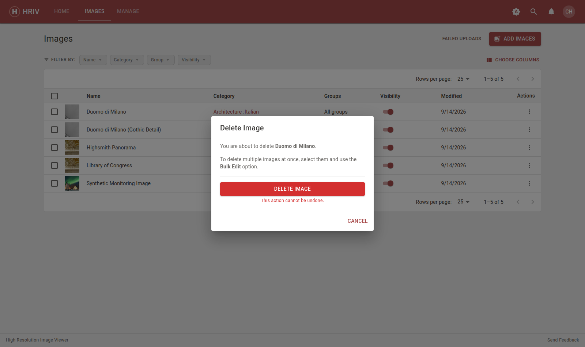

# Managing Images

The **Images** tab lists every image in the library in one table — the
fastest way to find, fix, or tidy a set of images.

## Working with the table

- **Filter** — the **FILTER BY** row above the table has a button per column.
  Click one (e.g. _Category_) and type or tick values to narrow the list.
  Active filters show as removable chips.
- **Sort** — click a column heading to sort; click again to reverse.
- **Choose columns** — the **column icon** shows/hides columns.
- Tick the **checkboxes** on the left to select images for bulk actions.

## Add image details

Click an image's **name** (or ⋮ → **Details**, or the pencil on its tile)
to open **Edit Details**.

- **Name**, **Category**, **Copyright**, and **Note** — the note shows
  alongside the image for students.
- **Scale** and **Unit** — optional: pixels per real-world unit (e.g.
  `8` px per `um`). This unlocks measurement boxes in the viewer.

## Move an image to a different category

- **Drag** the image tile onto a category (on Home or in the Manage list).
- Or use ⋮ → **Move** in the table to pick a category from a list.
- Or change **Category** inside **Edit Details**.
- **Bulk:** select rows in the table → **Bulk Edit** → _Move to Category_.

## Reorder images

Drag tiles on the **Home** page to reorder them within a category — that's
the order students see.

## Measuring on an image

When Scale and Unit are set in Edit Details, the **selection tool**
(diagonal-arrow button in the viewer toolbar) draws boxes that display their
real size — great for calling out a feature's dimensions.

A box you draw stays private until you save or share it:

- **Padlock** — saves your boxes to the image so everyone who views it sees
  them (and can't move them). Unlock to edit again.
- **Share View** — copies a link that opens the image with your boxes drawn.
- **X** — clears all boxes.

## Annotating an image

Click the **pencil** in the viewer toolbar to draw directly on the image —
arrows to point at features, boxes and ellipses to outline regions, and text
or links to label them.

- **Draw:** pick a tool (rectangle, ellipse, arrow/line, text, link), pick a
  colour and line width, then drag on the image.
- **Change:** click an object to select it; drag the corners to resize.
  Shift-click to select several, or `Ctrl+C` / `Ctrl+V` to copy and paste.
- **Remove:** select an object and press `Delete`, or use **Delete Selected**
  in the toolbar. **Clear All** removes everything.
- **Move the toolbar:** if the annotation toolbar covers part of the image,
  drag its grip handle (⠿, left end) to move it anywhere inside the viewer —
  arrow keys nudge it when the handle is focused, and a double-click returns
  it to the top edge. The position is remembered until you reload the page.
- Click **Save** when finished — annotations are visible to everyone who can
  see the image. Press `Esc` or **Cancel** to discard your changes.

Annotating also works in fullscreen — open the viewer's fullscreen mode first,
then click the pencil.

## Hide an image

Open **Edit Details** and click **Hide Image** (top right). Hidden images
turn grey for you and disappear for students. Click again to show it.

## Delete images

- **One image:** ⋮ → **Delete** in the table (or inside Edit Details).
- **Many:** select the checkboxes → **Delete Selected**.

Deleting removes the image and its tiles permanently — it can't be undone.
