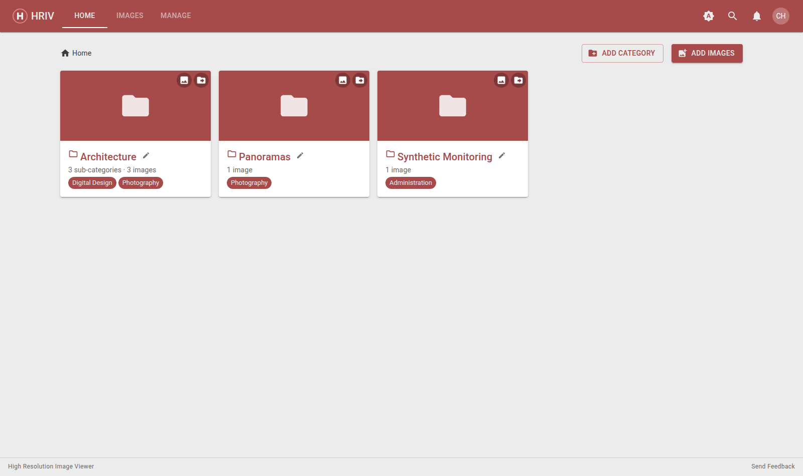

# Welcome to the HRIV Guide

A quick tour of the High Resolution Image Viewer (HRIV) for **instructors** and
**administrators**.

HRIV is a shared library of high-resolution images. Students browse what you
publish — you decide what they see and how it's organized.

## The layout at a glance

- **Home** – browse the image library
- **Images** – a table of every image, with filters and bulk actions
- **Manage** – categories, groups, and the site-wide announcement
- **Bell icon** – notifications, "What's New", this guide, and app info
- **Your avatar** – account details and sign out

## What's in this guide

- [Browsing & Viewing](browsing) — finding and zooming in on images
- [Managing Categories](categories) — organize the library into folders
- [Managing Images](images) — details, annotations, moving, deleting
- [Managing Groups](groups) — control which students see which categories
- [Announcements](announcements) — post a message everyone sees
- [Getting Help](help) — questions and feedback

::: tip Students?
Students only see the **Home** tab and the categories you make visible to
them. Everything in this guide is for instructors and administrators.
:::
